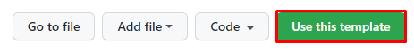

# F&E DATA ENGINEERING PROJECT

3.1	Introduction

Application architecture refers to the design and structure the FE Project. It defines how the different components of the application interact with each other, how data flows between them, and how they collectively fulfill the application’s functional and non-functional requirements.

3.2	Solution Overview:
This document presents the solution architecture for the data analytics project serving the Fertility and Endo department. The aim is to provide valuable insights on medications and enable better business/client decisions.

3.3	Application Layers:
The solution is designed as a data value chain, starting with dataset ingestion, followed by data processing and storage. Downstream, data visualization is implemented to offer UpToDate, consistent, and reliable data visualization for end-users.

Application Architecture Figure

 

## Overview

Here you want to write a short overview of the goals of your project and how it works at a high level. If possible, include one or two images of the end product and architecture diagram (see examples below). diagrams.net is a great tool for creating architecture diagrams.

### Data Visualization

### Data Architecture

If you decide to include this, you should also talk a bit about why you chose the architecture and tools you did for this project.

## Prerequisites

Directions or anything needed before running the project.

- Prerequisite 1
- Prerequisite 2
- Prerequisite 3

## How to Run This Project

Replace the example step-by-step instructions with your own.

1. Install x packages
2. Run command: `python x`
3. Make sure it's running properly by checking z
4. To clean up at the end, run script: `python cleanup.py`

## Lessons Learned

It's good to reflect on what you learned throughout the process of building this project. Here you might discuss what you would have done differently if you had more time/money/data. Did you end up choosing the right tools or would you try something else next time?

## Contact

Please feel free to contact me if you have any questions at: LinkedIn, Twitter
